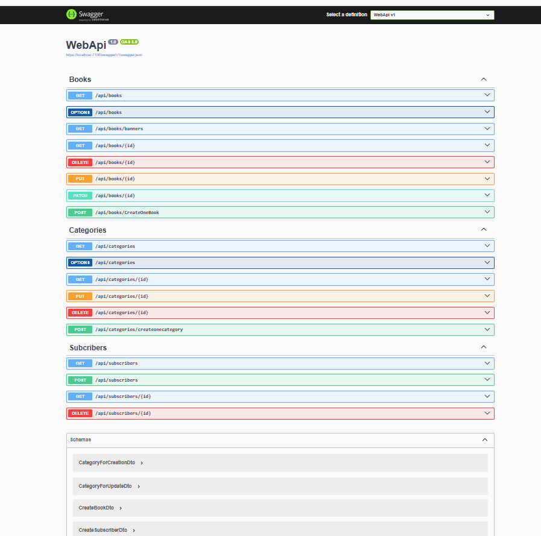
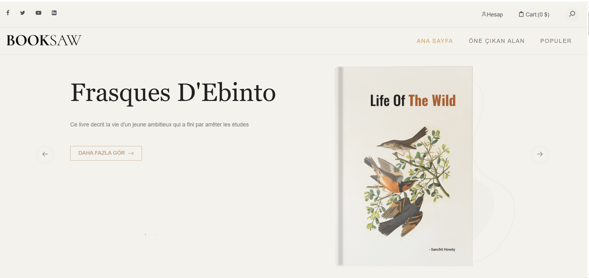
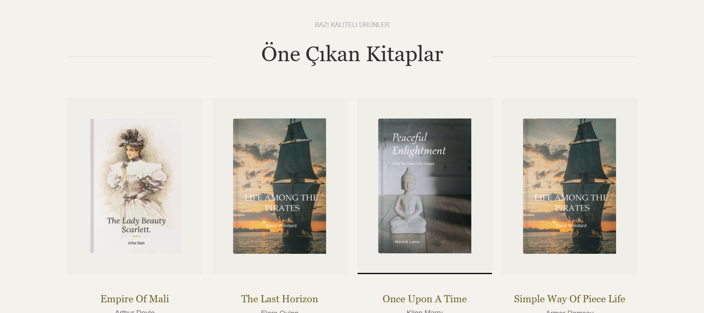
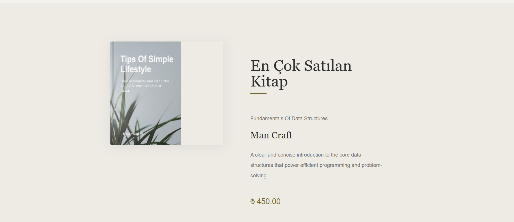
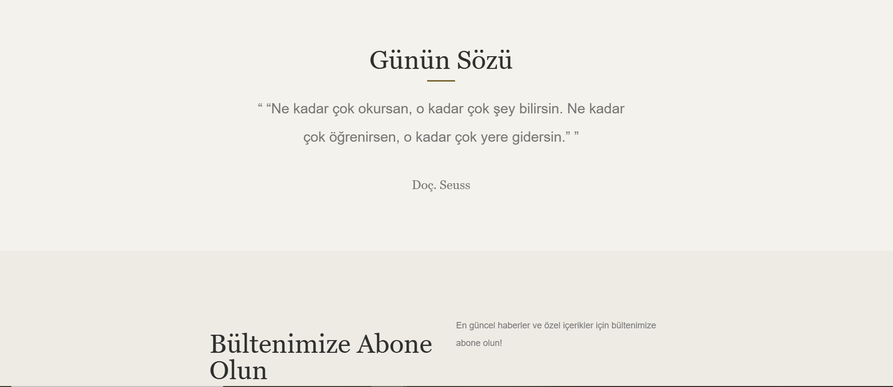
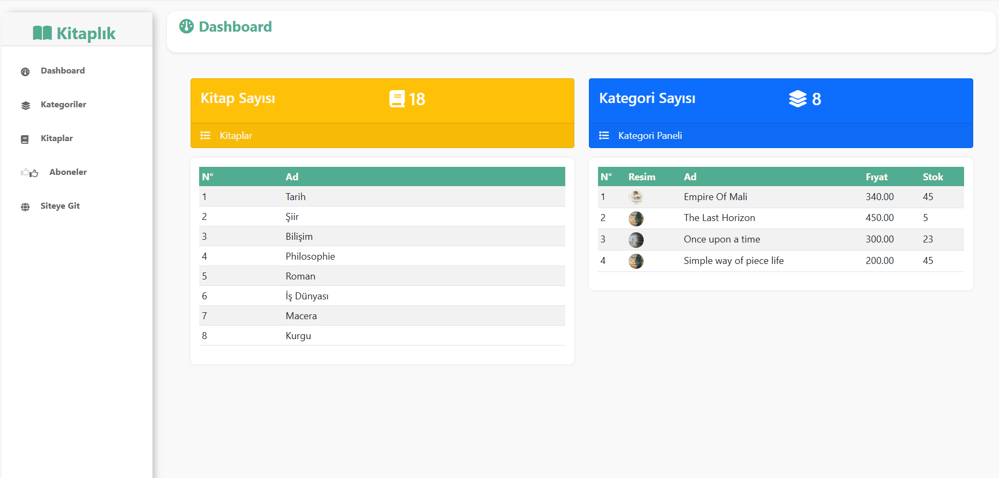
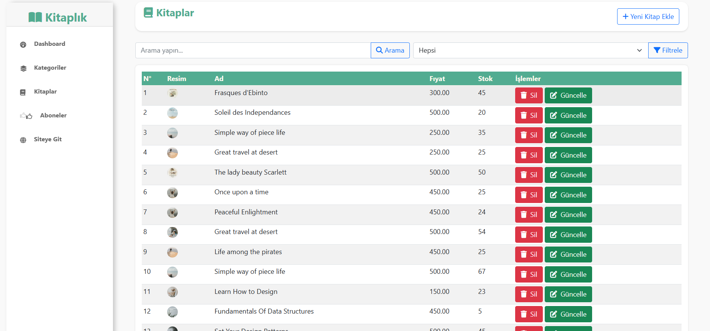
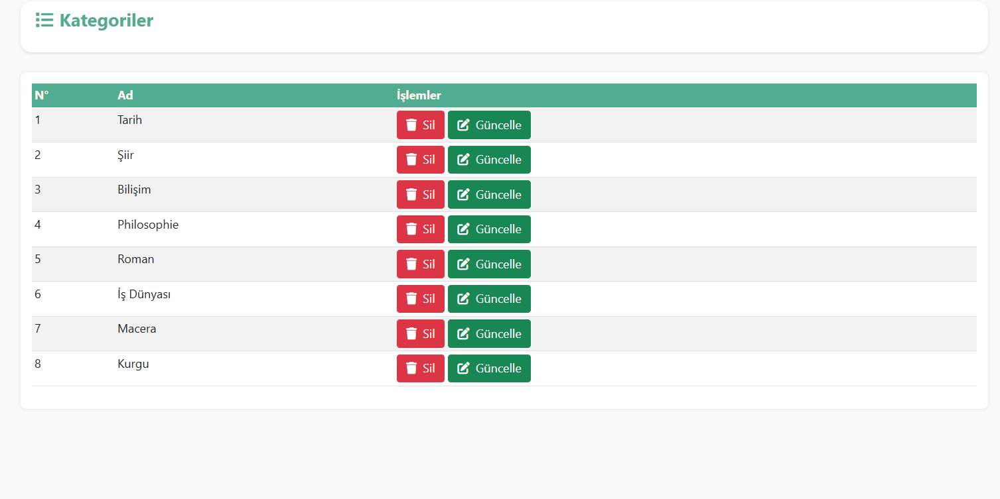
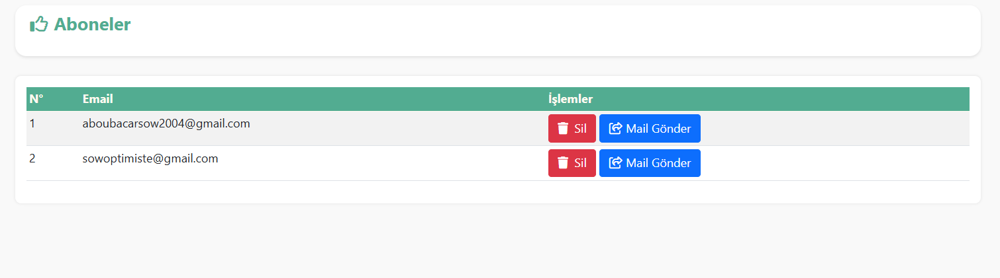

# BookSaw Projesi

#### This project Booksaw is full-stack project that coupled ASP.NET CORE WEB API(RESTful API) & ASP.NET CORE MVC(Model-View-Controller)

#### Booksaw's Logic
Booksaw is a web application that's built using ASP.NET CORE MVC and its consumes an ASP.NET CORE WEB API.

#### Project's Structure
##### Backend:
This part is built using Repository & Unit Of Work Design Pattern and contains five (5) layers
- **Entities**
- **Repositories**
- **Services**
- **Presentation**
- **WebAPI**
##### Front-end:
This part is build using service-oriented architecture. This approach allowed us to only call the required service and strictly follow the Single Responsibility Principle, improving maintainability and readability across the application. So i can say that we have mainly two(2) layers:
- **Services**
- **WebUI**

#### What elements are under hood?
#### 🛠️ Technologies Used:
- **📝 Comprehensive Logging**
- **❌ Global Error Handling**
- **🔄 Automatic Object Mapping**
- **✅ Request Validation**
- **⚙️ Asynchronous Codebase**
- **🎯 Advanced Querying**
- **🧠 Caching Mechanism**
- **📘 Interactive Swagger Documentation**
- **🧪 Postman Testing Collection**
- **📝Sending real time Email**
- **🧠 Marvin.Cache.Headers**
- **🧾 NewtonsoftJson**

#### Swagger Documentation:

#### Banner 

#### Feature 

#### Top Book 

#### Popular Books 

#### Today's quote 

#### Dashboard 

#### Books 

#### Categories 

#### Subscribers 

